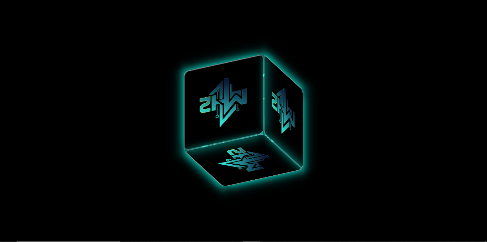
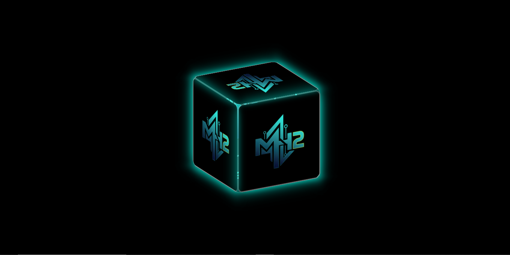

An **interactive 3D rotating cube** built with **HTML, CSS, and JavaScript**.  
Drag with your mouse or let it auto-rotate to view all sides!  


---

## Features

- Fully interactive 3D cube
- Drag with mouse to rotate
- Auto rotation when idle
- Smooth CSS and JS animations
- Responsive and centered in viewport

## Usage

1. Clone the repository:

```bash
git clone https://github.com/YOUR_USERNAME/cube-gallery.git
